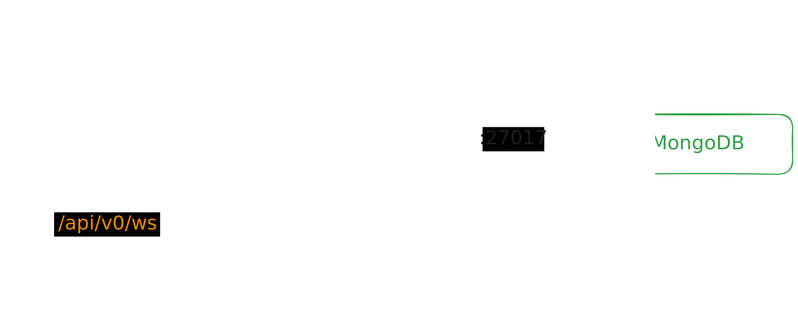

# Архитектура приложения

Schedge состоит из 4 основных компонентов:

1. **Веб-интерфейс**: предоставляет пользователю возможность взаимодействовать с приложением,
   управлять задачами и просматривать расписание.

2. **Backend**: обеспечивает связь между веб-интерфейсом и серверной частью,
   позволяя выполнять CRUD-операции над задачами и получать расписание.

3. **Солвер расписания**: алгоритмический модуль, который принимает задачи
   и генерирует оптимальное расписание с учётом заданных ограничений и предпочтений.

4. **База данных**: хранит информацию о задачах, их параметрах и сгенерированном расписании.

## Веб интерфейс

Веб-интерфейс реализован с использованием [Solid.js](https://www.solidjs.com/),
а также [Tailwind CSS](https://tailwindcss.com/) для стилизации и
компонентов из [Flowbite](https://flowbite.com/). В качестве метафреймворка
используется [Vite](https://vitejs.dev/). Используется 
[TypeScript](https://www.typescriptlang.org/).

Выбор технологий обусловлен их популярностью, активным сообществом и
хорошей производительностью. Solid.js обеспечивает высокую скорость
отрисовки и реактивность, что критично для интерактивного веб-приложения,
особенно при работе с большим количеством задач.

Tailwind CSS позволяет быстро создавать адаптивный и современный интерфейс,
а Flowbite предоставляет готовые компоненты, что ускоряет разработку.

Vite обеспечивает быструю сборку и горячую перезагрузку,
что значительно ускоряет процесс разработки и тестирования.

TypeScript добавляет статическую типизацию, что помогает
избежать ошибок на этапе компиляции и улучшает поддержку IDE.

## Backend

Backend реализован на [Python](https://www.python.org/), используя
[aiohttp](https://docs.aiohttp.org/en/stable/) для асинхронной работы,
что позволяет эффективно обрабатывать множество запросов
и обеспечивает высокую производительность.

Данные хранятся в [MongoDB](https://www.mongodb.com/),
в базе данных без схемы, что позволяет гибко управлять
структурой данных и легко адаптироваться к изменениям в требованиях.

Сервер реализует RESTful API, позволяя выполнять CRUD-операции
над задачами и получать сгенерированное расписание.

Помимо этого, сервер обеспечивает интерактивность с помощью
опционального WebSocket-соединения, что позволяет
обновлять данные в реальном времени.

## Солвер расписания

Солвер расписания реализован на [Rust](https://www.rust-lang.org/),
из-за его высокой производительности и безопасности.

Сам солвер представляет из себя REST API с одним эндпоинтом,
который принимает задачи в формате JSON и возвращает сгенерированное расписание.

Алгоритм солвера основан на случайном поиске.

Для реализации API используется [Actix Web](https://actix.rs/).

Решение отделить солвер от основного приложения позволяет
легко масштабировать его независимо от других компонентов,
а также не ограничивать выбор технологий для реализации солвера,
в том числе языка.

## Развертка

Для развертывания приложения используется [Docker](https://www.docker.com/),
[Kubernetes](https://kubernetes.io/) и [Helm](https://helm.sh/).

Docker позволяет упаковать приложение и его зависимости в контейнеры,
что обеспечивает консистентность среды выполнения и упрощает развертывание.
Kubernetes обеспечивает оркестрацию контейнеров, позволяя масштабировать приложение
и управлять его состоянием. Helm используется для управления
чартами Kubernetes, что упрощает процесс развертывания и обновления приложения.
